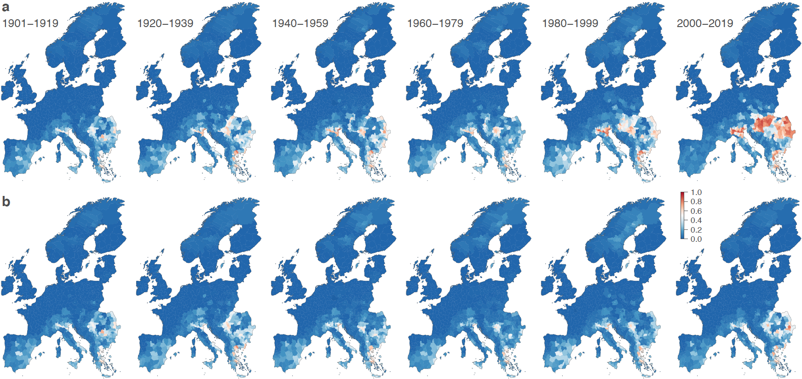

This repo gathers the input files and scripts related to our study entitled "[**Contribution of climate change to the spatial expansion of West Nile virus in Europe**](https://www.nature.com/articles/s41467-024-45290-3)" (Erazo *et al*. 2024, *Nature Communications*). R scripts related to the analyses are all gathered within the file `WNV_ENM_in_Europe.r`.

Abstract: West Nile virus (WNV) is an emerging mosquito-borne pathogen in Europe where it represents a new public health threat. While climate change has been cited as a potential driver of its spatial expansion on the continent, a formal evaluation of this causal relationship is lacking. Here, we investigate the extent to which WNV spatial expansion in Europe can be attributed to climate change while accounting for other direct human influences such as land use and human population changes. To this end, we trained ecological niche models to predict the risk of local WNV circulation leading to human cases to then unravel the isolated effect of climate change by comparing factual simulations to a counterfactual based on the same environmental changes but a counterfactual climate where long-term trends have been removed. Our findings demonstrate a notable increase in the area ecologically suitable for WNV circulation during the period 1901-2019, whereas this area remains largely unchanged in a no-climate-change counterfactual. We show that the drastic increase in the human population at risk of exposure is partly due to historical changes in population density, but that climate change has also been a critical driver behind the heightened risk of WNV circulation in Europe.

**Figure: changes in the ecological suitability of West Nile virus (WNV) in Europe.** Past and present ecological suitability estimated for each administrative unit are based on both the reconstructions of the historical climate (**a**) and a counterfactual baseline (**b**). Ecological suitability values are averaged over the estimates of ten independent BRT models trained on present-day data retrieved from the ISIMIP3a reanalysis dataset GSWP3-W5E5. See Figures S4-S6 in the Supplementary Information of our study for the estimates of three other ISIMIP3a reanalysis datasets (20CRv3, 20CRv3-ERA5, and 20CRv3-W5E5).
